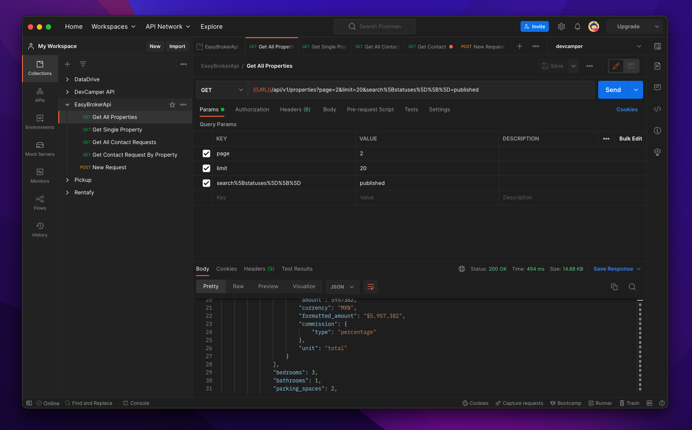
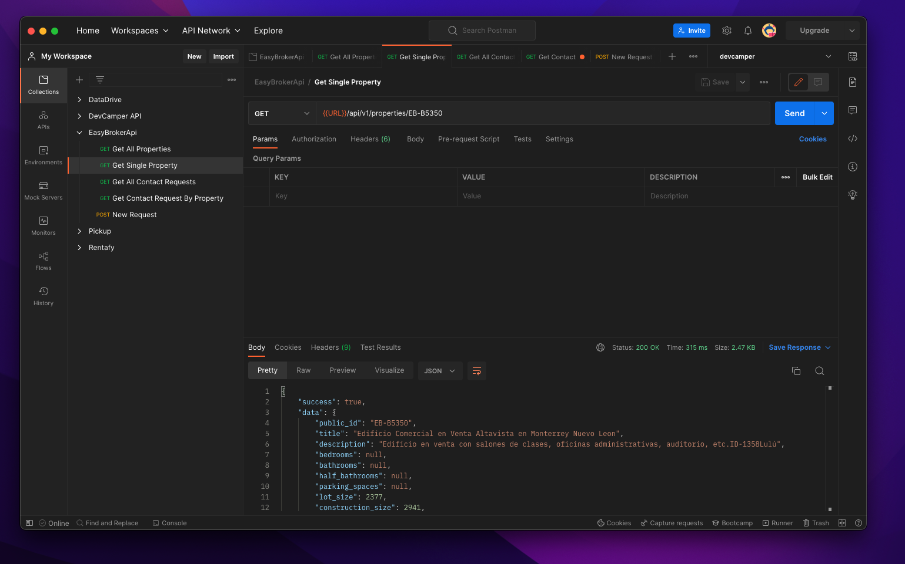
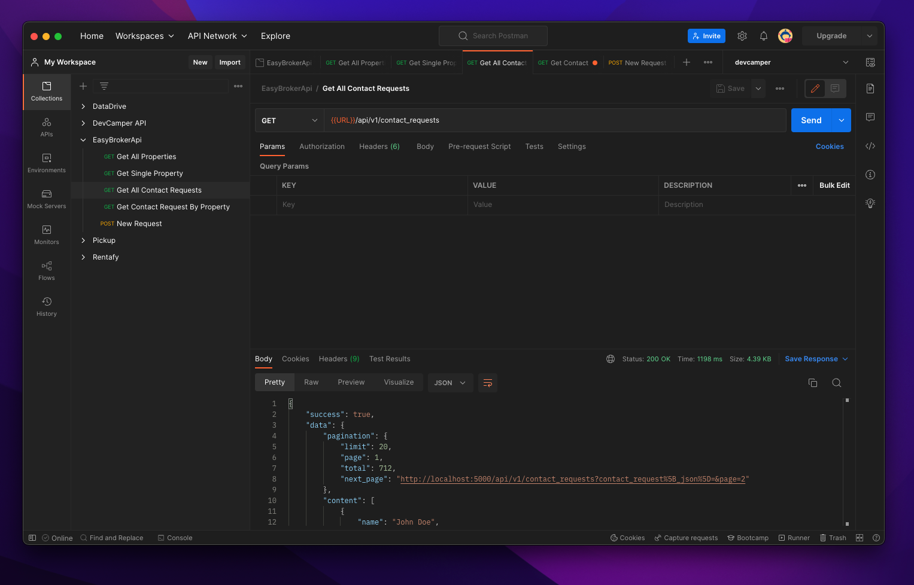
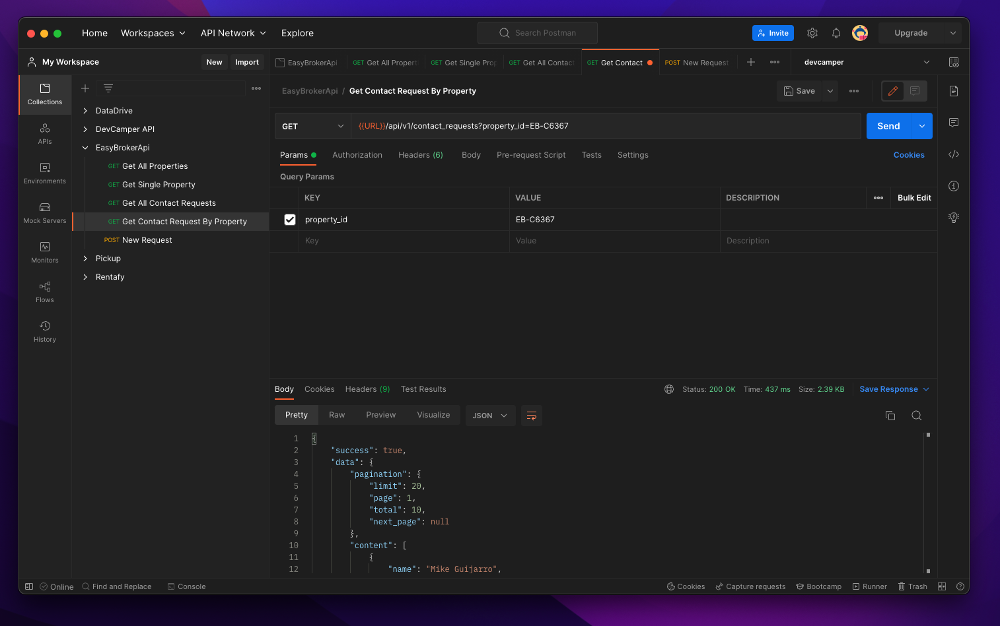
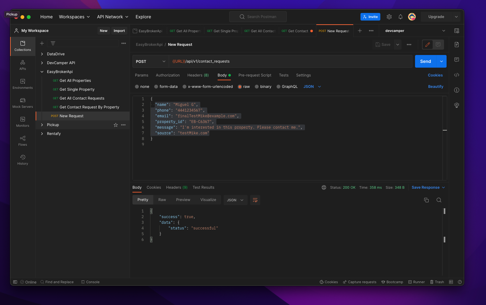

# EasyBroker Intern Project - Backend
This is a REST API developed with Express and Nodejs.

<h2 align="center">
  
 
    
  

  
   
</h2>

## General Information 💡
Use `npm run dev` to run this project.
It is necessary to create `config.env` inside `/config`. 

The environment variables required for this project are:
- `NODE_ENV=development`
- `PORT=5000`
- `EASY_BROKER_API_KEY=l7u502p8v46ba3ppgvj5y2aad50lb9` (This is the playground api key)
- `EASY_BROKER_URL=https://api.stagingeb.com/v1`
- `CLIENT_URL=http://localhost:5173`
- `BACKEND_URL=http://localhost:5000`

## Pics 🌅

  
 
    
  

   
  
 
    
  

   
  
 
    
  

   
  
 
    
  

   

## Notes 🛠️
- **What was the hardest thing you had to solve while building the backend?** One of the activities that took most of my time was the design of the backend, I wanted to showcase my habilities to write OOP while using functional programming in a clever way. Once I re-designed the EasyBrokerApi and implemented the main routes of the backend everything cammed up together. Another interesting challenge that I faced was to understand how to decode the percent encoding of EasyBroker Api, this was the first time that I worked with this URL encoding standard.
  
- **Are there any areas of your code that you think isn't that "clean"?** I am pretty happy about the backend, however I see several opportunity areas in my EasyBrokerApi Class: the naming conventions of the methods con be combersome: ex. `ebApi.properties('get', options)` fetch all properties, while `ebApi.properties('getProperty', options)` fetch one property. The method name `get` vs `getProperty` is not that clear with a reader that is not familiarized with the content of these functions. Once I think about I should have renamed it with something like `listAll` and `listProperty`. Also, I don't consider that passing string parameters as method names is 'typo' safe, I might need to refactor how to access this methods in the future. In a nutshell I think my naming conventions can improve and the methods 'callability' can be cleaner.
- **If you weren't able to finish: what were you able to complete and were you happy with your progress given the time constraints?** I was able to complete all the features and most of the objectives of this project. Unfortunately, due to time constraints, I was not able to implement a test coverage on my backend. Oscar Zatarain shared with a really interesting article on how to mock API server calls and how the logic behind it is to simulate the request and the data that the api would return (I read it 👀, however I did not had the chance to implement it...), once I deliver this project I will be implementing the Unit Test of this project locally.  
- **Are extra credit features that aren't required but nice to have?** It would habe been nice to implement caching for the `/properties` enpoint. In this way, we avoid calling the EasyBroker endpoint while receiving the same information over and over on each `/properties` call.   
